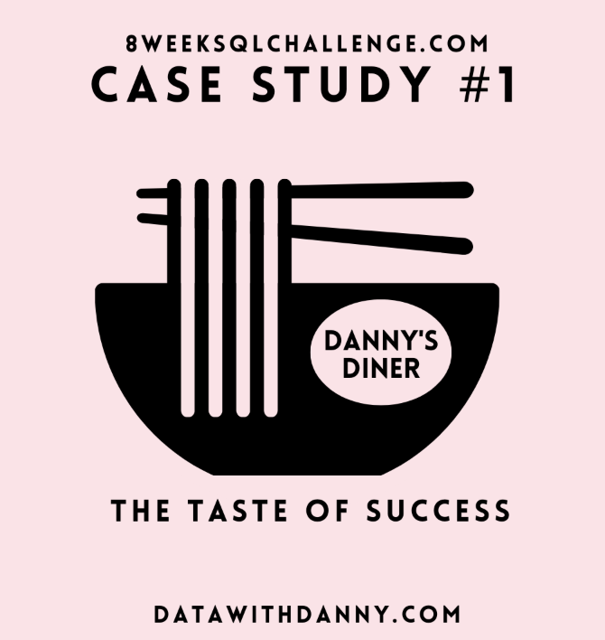
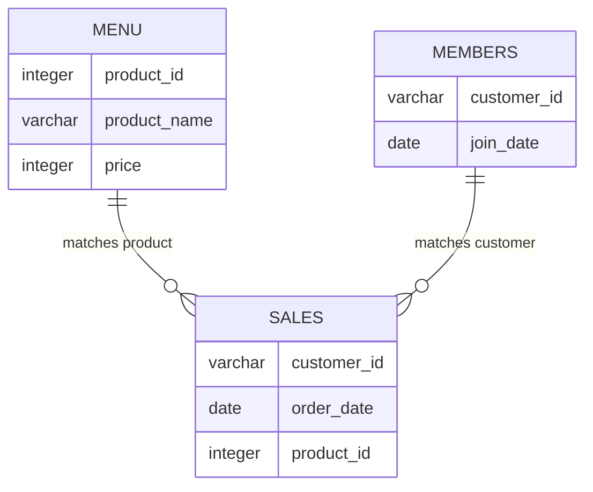

# Danny's Diner: Customer and Loyalty Analysis

<p align="center">
  
</p>

## Project Overview

Danny's Diner is a small restaurant that sells sushi, curry and ramen.

This case study uses PostgreSQL to analyse customer transactions, visit frequency, menu preferences and membership behaviour. The analysis also evaluates the restaurant's loyalty-points programme.

This project is based on Case Study 1 of the [8 Week SQL Challenge](https://8weeksqlchallenge.com/case-study-1/) created by Data With Danny.

---

## Table of Contents

* [Business Task](#business-task)
* [Dataset](#dataset)
* [Entity Relationship Diagram](#entity-relationship-diagram)
* [Tools and SQL Techniques](#tools-and-sql-techniques)
* [Key Findings](#key-findings)
* [Questions and Solutions](#questions-and-solutions)

  * [1. Total Spending by Customer](#1-total-spending-by-customer)
  * [2. Customer Visit Frequency](#2-customer-visit-frequency)
  * [3. First Purchase by Customer](#3-first-purchase-by-customer)
  * [4. Most Purchased Menu Item](#4-most-purchased-menu-item)
  * [5. Most Popular Item by Customer](#5-most-popular-item-by-customer)
  * [6. First Purchase as a Member](#6-first-purchase-as-a-member)
  * [7. Last Purchase Before Membership](#7-last-purchase-before-membership)
  * [8. Spending Before Membership](#8-spending-before-membership)
  * [9. Standard Loyalty Points](#9-standard-loyalty-points)
  * [10. January Points with Membership Bonus](#10-january-points-with-membership-bonus)
* [Bonus Questions](#bonus-questions)
* [Assumptions and Limitations](#assumptions-and-limitations)
* [What I Learned](#what-i-learned)

---

## Business Task

Danny wants to better understand his customers and improve the restaurant's loyalty programme.

The analysis focuses on:

* Customer spending
* Visit frequency
* Menu preferences
* Purchasing behaviour before and after membership
* Loyalty-points calculations

---

## Dataset

The database contains three tables.

### Sales

Contains individual customer purchases.

| Column        | Description                         |
| ------------- | ----------------------------------- |
| `customer_id` | Customer identifier                 |
| `order_date`  | Date of the purchase                |
| `product_id`  | Identifier of the purchased product |

### Menu

Contains the available menu items and their prices.

| Column         | Description            |
| -------------- | ---------------------- |
| `product_id`   | Product identifier     |
| `product_name` | Name of the menu item  |
| `price`        | Price of the menu item |

### Members

Contains the date each customer joined the loyalty programme.

| Column        | Description           |
| ------------- | --------------------- |
| `customer_id` | Customer identifier   |
| `join_date`   | Membership start date |

---

## Entity Relationship Diagram



The main relationships are:

* `sales.product_id` joins to `menu.product_id`
* `sales.customer_id` joins to `members.customer_id`

---

## Tools and SQL Techniques

### Tools

* PostgreSQL
* DB Fiddle
* GitHub
* Markdown

### SQL techniques

* `INNER JOIN`
* `LEFT JOIN`
* Aggregate functions
* `GROUP BY`
* Common Table Expressions
* `CASE` expressions
* Window functions
* Date filtering
* Conditional aggregation

---

## Key Findings

* Customer A spent the most at **$76**.
* Customer B visited most frequently, with purchases on **6 different days**.
* Ramen was the most purchased menu item, with **8 purchases**.
* Ramen was the most popular item for customers A and C.
* Customer B purchased sushi, curry and ramen equally often.
* Customer B earned the most points under the standard loyalty rules.
* With the January membership bonus applied, Customer A earned **1,370 points** and Customer B earned **820 points**.

---

# Questions and Solutions

## 1. Total Spending by Customer

### Business question

What is the total amount each customer spent at the restaurant?

### SQL approach

Join the `sales` and `menu` tables using `product_id`, then calculate the total price of all purchases for each customer.

### Query

```sql
SELECT
    s.customer_id,
    SUM(m.price) AS total_spent
FROM dannys_diner.sales AS s
INNER JOIN dannys_diner.menu AS m
    ON s.product_id = m.product_id
GROUP BY s.customer_id
ORDER BY total_spent DESC;
```

### Result

| Customer | Total spent |
| -------- | ----------: |
| A        |          76 |
| B        |          74 |
| C        |          36 |

### Insight

Customer A generated the highest revenue at $76. Customer B spent only $2 less, while Customer C spent considerably less than the other customers.

---

## 2. Customer Visit Frequency

### Business question

How many different days did each customer visit the restaurant?

### SQL approach

Use `COUNT(DISTINCT order_date)` because a customer may purchase several items during the same visit.

### Query

```sql
SELECT
    customer_id,
    COUNT(DISTINCT order_date) AS visit_days
FROM dannys_diner.sales
GROUP BY customer_id
ORDER BY visit_days DESC;
```

### Result

| Customer | Visit days |
| -------- | ---------: |
| B        |          6 |
| A        |          4 |
| C        |          2 |

### Insight

Customer B visited most frequently, while Customer C made purchases on only two different days.

---

## 3. First Purchase by Customer

### Business question

What was the first menu item purchased by each customer?

### SQL approach

Rank each customer's purchases by date using `DENSE_RANK()`.

`DENSE_RANK()` is used because customers may purchase more than one product on the same date. Since the dataset does not contain timestamps, products purchased on the same first date must be treated as simultaneous purchases.

### Query

```sql
WITH ranked_purchases AS (
    SELECT
        s.customer_id,
        s.order_date,
        m.product_name,
        DENSE_RANK() OVER (
            PARTITION BY s.customer_id
            ORDER BY s.order_date
        ) AS purchase_rank
    FROM dannys_diner.sales AS s
    INNER JOIN dannys_diner.menu AS m
        ON s.product_id = m.product_id
)

SELECT DISTINCT
    customer_id,
    product_name
FROM ranked_purchases
WHERE purchase_rank = 1
ORDER BY customer_id, product_name;
```

### Result

| Customer | First product |
| -------- | ------------- |
| A        | curry         |
| A        | sushi         |
| B        | curry         |
| C        | ramen         |

### Insight

Customer A purchased both sushi and curry on the first recorded visit. Without timestamps, it is not possible to determine which product was ordered first.

---

## 4. Most Purchased Menu Item

### Business question

Which menu item was purchased most frequently by all customers?

### SQL approach

Count the number of sales records for each menu item and sort the results from highest to lowest.

### Query

```sql
SELECT
    m.product_name,
    COUNT(*) AS purchase_count
FROM dannys_diner.sales AS s
INNER JOIN dannys_diner.menu AS m
    ON s.product_id = m.product_id
GROUP BY m.product_name
ORDER BY purchase_count DESC
LIMIT 1;
```

### Result

| Product | Purchases |
| ------- | --------: |
| ramen   |         8 |

### Insight

Ramen was the restaurant's most frequently purchased menu item.

---

## 5. Most Popular Item by Customer

### Business question

Which item was purchased most frequently by each customer?

### SQL approach

First count how often each customer purchased each product. Then rank the products within each customer group.

`DENSE_RANK()` keeps all products when multiple items share the same highest purchase count.

### Query

```sql
WITH product_counts AS (
    SELECT
        s.customer_id,
        m.product_name,
        COUNT(*) AS purchase_count
    FROM dannys_diner.sales AS s
    INNER JOIN dannys_diner.menu AS m
        ON s.product_id = m.product_id
    GROUP BY
        s.customer_id,
        m.product_name
),

ranked_products AS (
    SELECT
        customer_id,
        product_name,
        purchase_count,
        DENSE_RANK() OVER (
            PARTITION BY customer_id
            ORDER BY purchase_count DESC
        ) AS popularity_rank
    FROM product_counts
)

SELECT
    customer_id,
    product_name,
    purchase_count
FROM ranked_products
WHERE popularity_rank = 1
ORDER BY customer_id, product_name;
```

### Result

| Customer | Most popular product | Purchases |
| -------- | -------------------- | --------: |
| A        | ramen                |         3 |
| B        | curry                |         2 |
| B        | ramen                |         2 |
| B        | sushi                |         2 |
| C        | ramen                |         3 |

### Insight

Ramen was the most popular product for customers A and C. Customer B purchased every menu item twice, so no single favourite product can be identified.

---

## 6. First Purchase as a Member

### Business question

Which item did each customer purchase first after becoming a member?

### Assumption

A purchase made on the membership join date is considered a member purchase.

### SQL approach

Join the transaction and membership tables, keep purchases made on or after the join date, and rank the purchases by date.

### Query

```sql
WITH member_purchases AS (
    SELECT
        s.customer_id,
        s.order_date,
        m.product_name,
        DENSE_RANK() OVER (
            PARTITION BY s.customer_id
            ORDER BY s.order_date
        ) AS purchase_rank
    FROM dannys_diner.sales AS s
    INNER JOIN dannys_diner.members AS mb
        ON s.customer_id = mb.customer_id
    INNER JOIN dannys_diner.menu AS m
        ON s.product_id = m.product_id
    WHERE s.order_date >= mb.join_date
)

SELECT DISTINCT
    customer_id,
    product_name
FROM member_purchases
WHERE purchase_rank = 1
ORDER BY customer_id, product_name;
```

### Result

| Customer | First member purchase |
| -------- | --------------------- |
| A        | curry                 |
| B        | sushi                 |

### Insight

Customer A purchased curry on the membership join date. Customer B's first purchase after joining was sushi.

---

## 7. Last Purchase Before Membership

### Business question

Which item did each member purchase immediately before joining?

### SQL approach

Keep purchases made before the membership date and rank the purchase dates in descending order.

`DENSE_RANK()` preserves multiple products purchased on the same final pre-membership date.

### Query

```sql
WITH pre_membership_purchases AS (
    SELECT
        s.customer_id,
        s.order_date,
        m.product_name,
        DENSE_RANK() OVER (
            PARTITION BY s.customer_id
            ORDER BY s.order_date DESC
        ) AS purchase_rank
    FROM dannys_diner.sales AS s
    INNER JOIN dannys_diner.members AS mb
        ON s.customer_id = mb.customer_id
    INNER JOIN dannys_diner.menu AS m
        ON s.product_id = m.product_id
    WHERE s.order_date < mb.join_date
)

SELECT DISTINCT
    customer_id,
    product_name
FROM pre_membership_purchases
WHERE purchase_rank = 1
ORDER BY customer_id, product_name;
```

### Result

| Customer | Last pre-membership product |
| -------- | --------------------------- |
| A        | curry                       |
| A        | sushi                       |
| B        | sushi                       |

### Insight

Customer A purchased both sushi and curry during the final visit before joining. Customer B purchased sushi immediately before becoming a member.

---

## 8. Spending Before Membership

### Business question

How many items did each member purchase, and how much did they spend before joining?

### SQL approach

Filter for transactions before the membership date, then count the purchased items and calculate total spending.

### Query

```sql
SELECT
    s.customer_id,
    COUNT(*) AS total_items,
    SUM(m.price) AS total_spent
FROM dannys_diner.sales AS s
INNER JOIN dannys_diner.members AS mb
    ON s.customer_id = mb.customer_id
INNER JOIN dannys_diner.menu AS m
    ON s.product_id = m.product_id
WHERE s.order_date < mb.join_date
GROUP BY s.customer_id
ORDER BY s.customer_id;
```

### Result

| Customer | Items purchased | Total spent |
| -------- | --------------: | ----------: |
| A        |               2 |          25 |
| B        |               3 |          40 |

### Insight

Before becoming members, Customer B purchased one more item and spent $15 more than Customer A.

---

## 9. Standard Loyalty Points

### Business question

How many points would each customer earn under the following rules?

* Every $1 spent earns 10 points.
* Sushi earns twice as many points.
* Sushi therefore earns 20 points for every $1 spent.

### SQL approach

Use a `CASE` expression to assign 20 points per dollar to sushi and 10 points per dollar to all other menu items.

### Query

```sql
SELECT
    s.customer_id,
    SUM(
        CASE
            WHEN m.product_name = 'sushi'
                THEN m.price * 20
            ELSE m.price * 10
        END
    ) AS total_points
FROM dannys_diner.sales AS s
INNER JOIN dannys_diner.menu AS m
    ON s.product_id = m.product_id
GROUP BY s.customer_id
ORDER BY total_points DESC;
```

### Result

| Customer | Total points |
| -------- | -----------: |
| B        |          940 |
| A        |          860 |
| C        |          360 |

### Insight

Customer B earned the most loyalty points because of repeated sushi purchases.

---

## 10. January Points with Membership Bonus

### Business question

During the first week after a customer joins the programme, including the join date, all menu items earn double points.

How many points did customers A and B have at the end of January?

### Points rules

* Every $1 normally earns 10 points.
* Sushi always earns 20 points per dollar.
* During the first seven membership days, every product earns 20 points per dollar.
* The first seven days include the join date.
* Purchases made before joining earn points under the standard rules.
* Only purchases made during January are included.

### SQL approach

Use the membership date to identify the seven-day promotional period. Apply double points during that period and apply the sushi multiplier to purchases outside the promotional period.

### Query

```sql
SELECT
    s.customer_id,
    SUM(
        CASE
            WHEN s.order_date BETWEEN mb.join_date
                                  AND mb.join_date + 6
                THEN m.price * 20
            WHEN m.product_name = 'sushi'
                THEN m.price * 20
            ELSE m.price * 10
        END
    ) AS january_points
FROM dannys_diner.sales AS s
INNER JOIN dannys_diner.members AS mb
    ON s.customer_id = mb.customer_id
INNER JOIN dannys_diner.menu AS m
    ON s.product_id = m.product_id
WHERE s.order_date BETWEEN DATE '2021-01-01'
                       AND DATE '2021-01-31'
GROUP BY s.customer_id
ORDER BY s.customer_id;
```

### Result

| Customer | January points |
| -------- | -------------: |
| A        |          1,370 |
| B        |            820 |

### Insight

Customer A earned more January points because several purchases occurred during the first-week promotional period.

---

# Bonus Questions

## Bonus 1: Membership Status for Every Purchase

### Business question

Create a transaction table containing:

* Customer ID
* Order date
* Product name
* Price
* Membership status

Purchases made on or after the membership join date should be marked as `Y`. Other purchases should be marked as `N`.

### Query

```sql
SELECT
    s.customer_id,
    s.order_date,
    m.product_name,
    m.price,
    CASE
        WHEN mb.join_date IS NOT NULL
             AND s.order_date >= mb.join_date
            THEN 'Y'
        ELSE 'N'
    END AS member_status
FROM dannys_diner.sales AS s
LEFT JOIN dannys_diner.members AS mb
    ON s.customer_id = mb.customer_id
INNER JOIN dannys_diner.menu AS m
    ON s.product_id = m.product_id
ORDER BY
    s.customer_id,
    s.order_date,
    m.product_name;
```

### Result

| Customer | Order date | Product | Price | Member |
| -------- | ---------- | ------- | ----: | ------ |
| A        | 2021-01-01 | curry   |    15 | N      |
| A        | 2021-01-01 | sushi   |    10 | N      |
| A        | 2021-01-07 | curry   |    15 | Y      |
| A        | 2021-01-10 | ramen   |    12 | Y      |
| A        | 2021-01-11 | ramen   |    12 | Y      |
| A        | 2021-01-11 | ramen   |    12 | Y      |
| B        | 2021-01-01 | curry   |    15 | N      |
| B        | 2021-01-02 | curry   |    15 | N      |
| B        | 2021-01-04 | sushi   |    10 | N      |
| B        | 2021-01-11 | sushi   |    10 | Y      |
| B        | 2021-01-16 | ramen   |    12 | Y      |
| B        | 2021-02-01 | ramen   |    12 | Y      |
| C        | 2021-01-01 | ramen   |    12 | N      |
| C        | 2021-01-01 | ramen   |    12 | N      |
| C        | 2021-01-07 | ramen   |    12 | N      |

---

## Bonus 2: Rank Member Purchases

### Business question

Rank purchases made after customers joined the loyalty programme.

Purchases made before membership should have a `NULL` ranking.

### Query

```sql
WITH customer_orders AS (
    SELECT
        s.customer_id,
        s.order_date,
        m.product_name,
        m.price,
        CASE
            WHEN mb.join_date IS NOT NULL
                 AND s.order_date >= mb.join_date
                THEN 'Y'
            ELSE 'N'
        END AS member_status
    FROM dannys_diner.sales AS s
    LEFT JOIN dannys_diner.members AS mb
        ON s.customer_id = mb.customer_id
    INNER JOIN dannys_diner.menu AS m
        ON s.product_id = m.product_id
)

SELECT
    customer_id,
    order_date,
    product_name,
    price,
    member_status,
    CASE
        WHEN member_status = 'Y'
            THEN DENSE_RANK() OVER (
                PARTITION BY customer_id, member_status
                ORDER BY order_date
            )
        ELSE NULL
    END AS member_purchase_rank
FROM customer_orders
ORDER BY
    customer_id,
    order_date,
    product_name;
```

### Result

| Customer | Order date | Product | Price | Member | Rank |
| -------- | ---------- | ------- | ----: | ------ | ---: |
| A        | 2021-01-01 | curry   |    15 | N      | NULL |
| A        | 2021-01-01 | sushi   |    10 | N      | NULL |
| A        | 2021-01-07 | curry   |    15 | Y      |    1 |
| A        | 2021-01-10 | ramen   |    12 | Y      |    2 |
| A        | 2021-01-11 | ramen   |    12 | Y      |    3 |
| A        | 2021-01-11 | ramen   |    12 | Y      |    3 |
| B        | 2021-01-01 | curry   |    15 | N      | NULL |
| B        | 2021-01-02 | curry   |    15 | N      | NULL |
| B        | 2021-01-04 | sushi   |    10 | N      | NULL |
| B        | 2021-01-11 | sushi   |    10 | Y      |    1 |
| B        | 2021-01-16 | ramen   |    12 | Y      |    2 |
| B        | 2021-02-01 | ramen   |    12 | Y      |    3 |
| C        | 2021-01-01 | ramen   |    12 | N      | NULL |
| C        | 2021-01-01 | ramen   |    12 | N      | NULL |
| C        | 2021-01-07 | ramen   |    12 | N      | NULL |

---

## Assumptions and Limitations

* The dataset contains order dates but no timestamps.
* Purchases made on the same date cannot be placed in an exact sequence.
* Products purchased on the same first or last date are treated as tied.
* A purchase made on the membership join date is considered a member purchase.
* The January loyalty-points calculation assumes purchases made before membership still earn points under the standard rules.
* The dataset contains only three customers and three products.
* The results should not be treated as representative of a full restaurant operation.

---

## What I Learned

Through this project, I practised how to:

* Translate business questions into SQL queries.
* Join transaction, product and membership tables.
* Calculate customer-level metrics using aggregate functions.
* Use window functions to rank purchases within customer groups.
* Preserve tied results when timestamps are unavailable.
* Apply conditional business rules using `CASE`.
* Work with membership dates and promotional periods.
* Present SQL results as clear business insights.

---

## Source

The original case study and dataset were created by [Data With Danny](https://8weeksqlchallenge.com/case-study-1/).

All SQL queries, explanations and interpretations in this repository were written as part of my own analysis.
