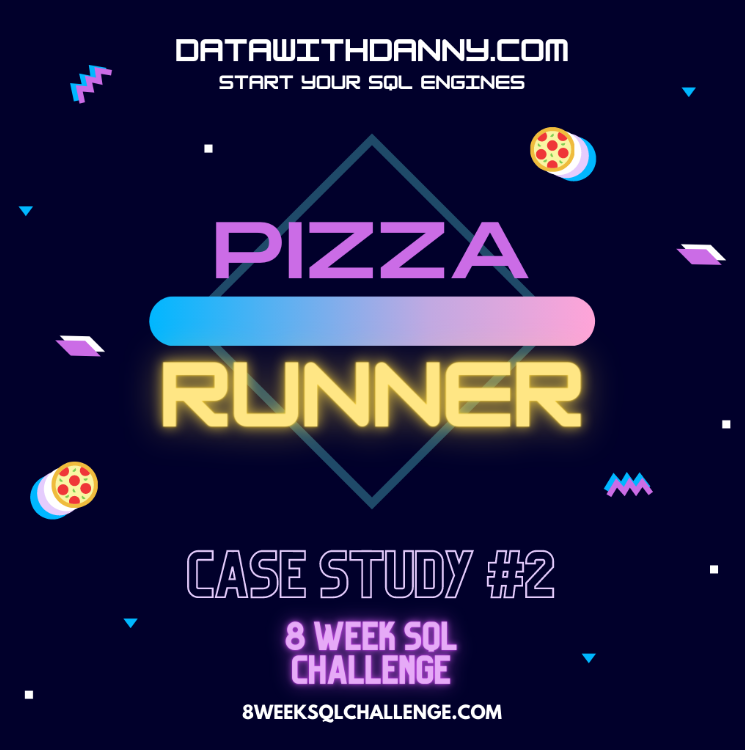
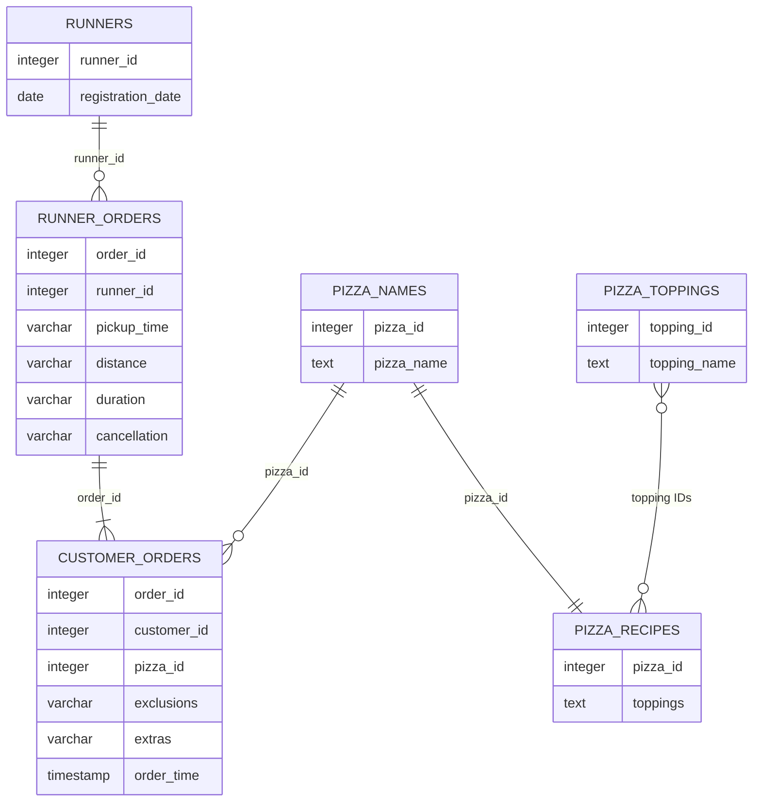

# Pizza Runner: Operations and Delivery Analysis

  

## Project Overview

Pizza Runner is a pizza delivery business that uses freelance runners to deliver customer orders.

This case study uses PostgreSQL to clean and analyse customer orders, deliveries, runner performance, pizza customisations, ingredients and business profitability.

This project is based on Case Study 2 of the [8 Week SQL Challenge](https://8weeksqlchallenge.com/case-study-2/) created by Data With Danny.

---

## Table of Contents

- [Business Task](#business-task)
- [Dataset](#dataset)
- [Entity Relationship Diagram](#entity-relationship-diagram)
- [Analysis Sections](#analysis-sections)
- [Tools and SQL Techniques](#tools-and-sql-techniques)
- [Source](#source)

---

## Business Task

Danny wants to understand how Pizza Runner is performing and identify opportunities to improve its operations.

The analysis focuses on:

- Customer ordering behaviour
- Successful and cancelled deliveries
- Runner performance
- Delivery speed and distance
- Pizza customisations
- Ingredient usage
- Revenue and profitability

---

## Dataset

The database contains six tables:

| Table | Description |
|---|---|
| `runners` | Runner registration information |
| `customer_orders` | Customer pizza orders and customisations |
| `runner_orders` | Delivery details, distance, duration and cancellations |
| `pizza_names` | Pizza names |
| `pizza_recipes` | Standard ingredients for each pizza |
| `pizza_toppings` | Available pizza toppings |

---

## Entity Relationship Diagram

---

## Analysis Sections

1. [Data Cleaning and Transformation](./01-data-cleaning.md)
2. [Pizza Metrics](./02-pizza-metrics.md)
3. [Runner and Customer Experience](./03-runner-customer-experience.md)
4. [Ingredient Optimisation](./04-ingredient-optimisation.md)
5. [Pricing and Ratings](./05-pricing-ratings.md)

---

## Tools and SQL Techniques

### Tools

- PostgreSQL
- DB Fiddle
- GitHub
- Markdown

### SQL techniques

- Data cleaning
- Type conversion
- String manipulation
- Table joins
- Aggregate functions
- Common Table Expressions
- Window functions
- Conditional logic
- Date and time calculations
- Unnesting comma-separated values

---

## Source

The original case study and dataset were created by [Data With Danny](https://8weeksqlchallenge.com/case-study-2/).

All SQL queries, explanations and interpretations in this repository are part of my own analysis.
