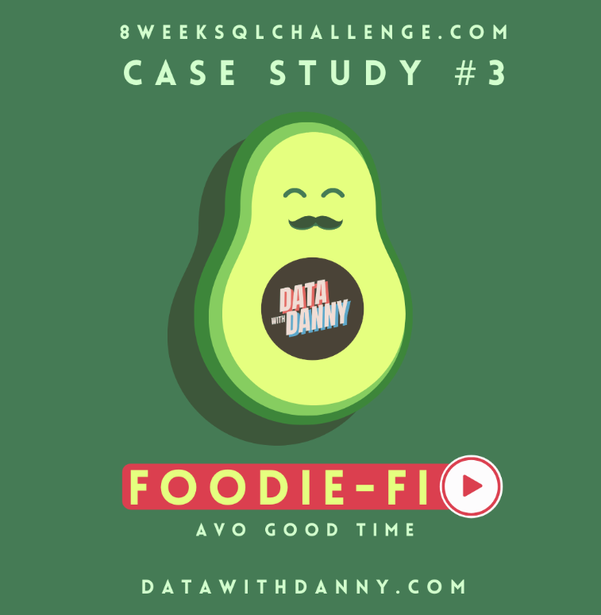
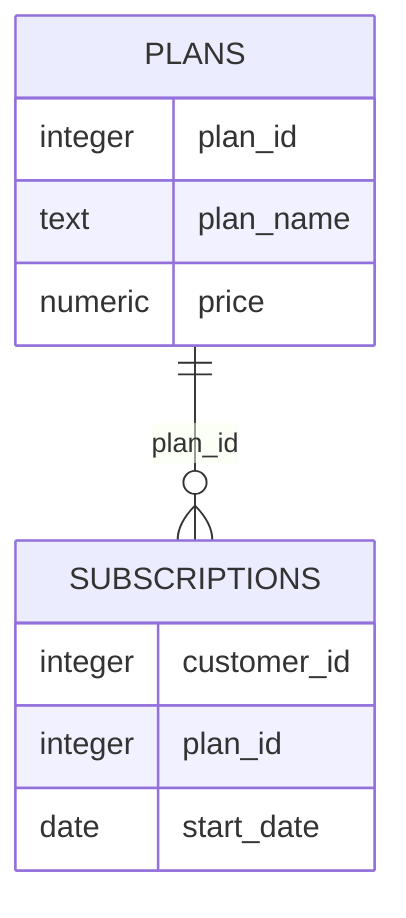

# Foodie-Fi: Subscription and Churn Analysis

  

## Project Overview

Foodie-Fi is a subscription-based streaming service focused entirely on food-related content.

This project uses PostgreSQL to analyse customer onboarding, subscription conversions, upgrades, churn and payment behaviour.

The analysis demonstrates how subscription data can be used to evaluate customer journeys and support product and business decisions.

This project is based on Case Study 3 of the [8 Week SQL Challenge](https://8weeksqlchallenge.com/case-study-3/) created by Data With Danny.

---

## Table of Contents

- [Business Task](#business-task)
- [Dataset](#dataset)
- [Subscription Plans](#subscription-plans)
- [Entity Relationship Diagram](#entity-relationship-diagram)
- [Analysis Sections](#analysis-sections)
- [Tools and SQL Techniques](#tools-and-sql-techniques)
- [Key Findings](#key-findings)
- [Source](#source)

---

## Business Task

Foodie-Fi wants to use its subscription data to better understand:

- Customer onboarding journeys
- Trial-to-paid conversion
- Subscription-plan preferences
- Customer upgrades and downgrades
- Customer churn
- Annual-plan adoption
- Payment schedules
- Business-growth opportunities

---

## Dataset

The database contains two tables:

| Table | Description |
|---|---|
| `plans` | Subscription plan names and prices |
| `subscriptions` | Customer plan changes and their effective dates |

---

## Subscription Plans

| Plan ID | Plan | Price |
|---:|---|---:|
| 0 | Trial | $0.00 |
| 1 | Basic monthly | $9.90 |
| 2 | Pro monthly | $19.90 |
| 3 | Pro annual | $199.00 |
| 4 | Churn | NULL |

### Plan rules

- Every customer begins with a seven-day free trial.
- Basic monthly customers have limited streaming access.
- Pro monthly and annual customers receive full access and offline viewing.
- Upgrades take effect immediately.
- Downgrades and cancellations take effect after the current billing period.
- Churned customers retain access until the end of their paid period.

---

## Entity Relationship Diagram

### Relationship

`subscriptions.plan_id` joins to `plans.plan_id`.

Each row in `subscriptions` represents the date on which a customer's new plan becomes effective.

---

## Analysis Sections

1. [Customer Journey](./01-customer-journey.md)
2. [Data Analysis](./02-data-analysis.md)
3. [Payments Challenge](./03-payments-challenge.md)
4. [Outside-the-Box Questions](./04-outside-the-box.md)

---

## Tools and SQL Techniques

### Tools

- PostgreSQL 13
- DB Fiddle
- GitHub
- Markdown

### SQL techniques

- Table joins
- Aggregate functions
- Common Table Expressions
- Window functions
- Conditional aggregation
- Date arithmetic
- Recursive and generated date series
- Customer transition analysis
- Cohort-style subscription analysis

---

## Key Findings

- Foodie-Fi acquired 1,000 customers.
- 30.7% of all customers eventually churned.
- 9.2% churned immediately after their trial.
- 54.6% moved from the trial to the basic monthly plan.
- 32.5% moved directly from the trial to the pro monthly plan.
- Only 3.7% selected the annual plan immediately after the trial.
- At the end of 2020, the pro monthly plan was the largest active subscription group.
- 195 customers upgraded to the annual plan during 2020.
- Customers took an average of approximately 105 days to move from joining Foodie-Fi to the annual plan.
- No customers downgraded from pro monthly to basic monthly during 2020.

---

## Source

The original case study and dataset were created by [Data With Danny](https://8weeksqlchallenge.com/case-study-3/).

All SQL queries, explanations and business interpretations in this repository form part of my own analysis.
