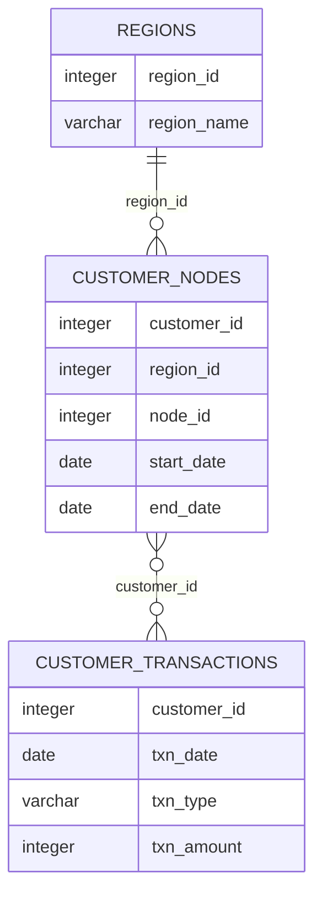

# Data Bank: Transactions and Data Allocation Analysis

  

## Project Overview

Data Bank is a digital bank that combines traditional banking activities with a distributed cloud-storage platform.

Customers are assigned to secure regional nodes, while their available data-storage allocation is linked to the amount of money held in their bank accounts.

This project uses PostgreSQL to analyse customer-node allocation, banking transactions, monthly balances and several possible data-provisioning models.

This project is based on Case Study 4 of the [8 Week SQL Challenge](https://8weeksqlchallenge.com/case-study-4/) created by Data With Danny.

---

## Table of Contents

- [Business Task](#business-task)
- [Dataset](#dataset)
- [Entity Relationship Diagram](#entity-relationship-diagram)
- [Analysis Sections](#analysis-sections)
- [Tools and SQL Techniques](#tools-and-sql-techniques)
- [Key Findings](#key-findings)
- [Assumptions and Limitations](#assumptions-and-limitations)
- [Source](#source)

---

## Business Task

The Data Bank management team wants to:

- Expand its customer base
- Understand customer distribution across global nodes
- Measure how frequently customers are reassigned
- Analyse deposits, purchases and withdrawals
- Calculate customer balances
- Estimate future cloud-storage requirements
- Compare alternative data-allocation models
- Evaluate an interest-based allocation model

---

## Dataset

The database contains three tables:

| Table | Description |
|---|---|
| `regions` | Region identifiers and names |
| `customer_nodes` | Customer allocation history across regional nodes |
| `customer_transactions` | Deposits, withdrawals and purchases |

---

## Entity Relationship Diagram

### Relationships

- `customer_nodes.region_id` joins to `regions.region_id`
- `customer_nodes.customer_id` logically joins to `customer_transactions.customer_id`
- A customer can have several node allocations and several transactions

The database does not include a separate customer table or a unique transaction identifier.

---

## Analysis Sections

1. [Customer Nodes Exploration](./01-customer-nodes.md)
2. [Customer Transactions](./02-customer-transactions.md)
3. [Data Allocation Challenge](./03-data-allocation.md)
4. [Interest-Based Allocation](./04-interest-challenge.md)
5. [Extension Insights](./05-extension-insights.md)

---

## Tools and SQL Techniques

### Tools

- PostgreSQL 13
- DB Fiddle
- GitHub
- Markdown

### SQL techniques

- Aggregate functions
- Table joins
- Common Table Expressions
- Window functions
- Running totals
- Date arithmetic
- Calendar generation
- Conditional aggregation
- Percentile calculations
- Trailing averages
- Financial transaction analysis

---

## Key Findings

- Data Bank operates five unique nodes.
- Every region has access to all five nodes.
- The dataset contains 500 unique customers.
- Customers are reassigned to another node approximately every 14 days.
- Deposits are the most frequent transaction type.
- Customers made approximately five deposits on average.
- The average historical deposit amount was approximately $508.61.
- Monthly closing balances can vary substantially between customers.
- Storage requirements differ significantly depending on whether allocation is monthly, based on a trailing average or updated in real time.

---

## Assumptions and Limitations

- The date `9999-12-31` represents an active node allocation and is excluded from completed reallocation calculations.
- Deposits increase account balances.
- Purchases and withdrawals reduce account balances.
- Negative balances are treated as requiring zero data allocation.
- Data allocation is assumed to use one storage unit for every monetary unit.
- The transaction table does not contain a unique transaction ID or transaction time. The exact sequence of multiple transactions occurring on the same day cannot therefore be determined.
- Allocation options require clearly stated timing assumptions because the original business requirements do not define every implementation detail.

---

## Source

The original case study, dataset and cover artwork were created by [Data With Danny](https://8weeksqlchallenge.com/case-study-4/).

All SQL queries, assumptions, explanations and business interpretations in this repository form part of my own analysis.
