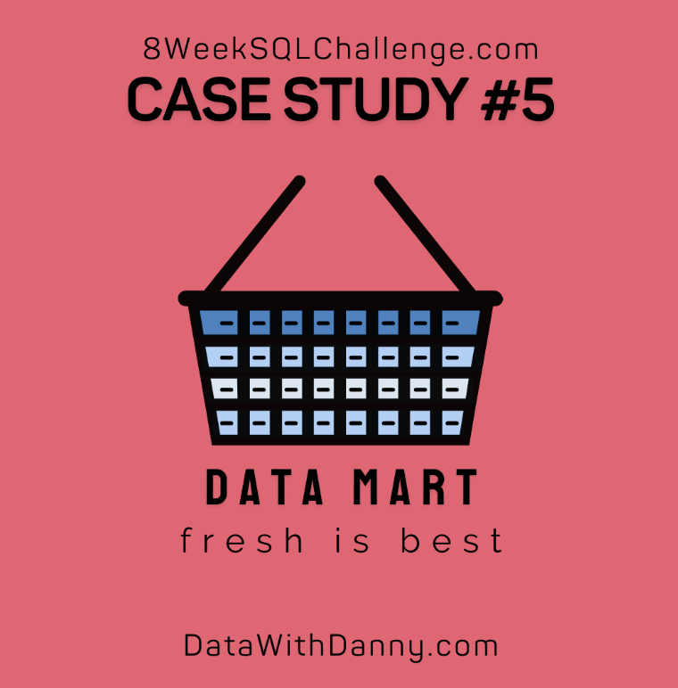
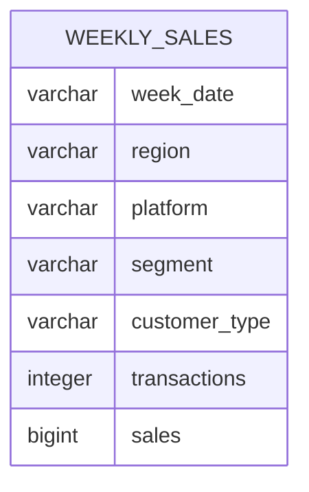

# Data Mart: Sustainable Packaging Impact Analysis

  

## Project Overview

Data Mart is an international supermarket specialising in fresh produce.

In June 2020, Data Mart introduced sustainable packaging throughout its supply chain. This project uses PostgreSQL to measure the effect of that change on sales performance across regions, platforms and customer groups.

This project is based on Case Study 5 of the [8 Week SQL Challenge](https://8weeksqlchallenge.com/case-study-5/) created by Data With Danny.

---

## Table of Contents

- [Business Task](#business-task)
- [Dataset](#dataset)
- [Table Structure](#table-structure)
- [Analysis Sections](#analysis-sections)
- [Tools and SQL Techniques](#tools-and-sql-techniques)
- [Key Findings](#key-findings)
- [Assumptions and Limitations](#assumptions-and-limitations)
- [Source](#source)

---

## Business Task

The analysis aims to answer three main questions:

- What was the measurable effect of the sustainable-packaging change introduced in June 2020?
- Which regions, platforms and customer groups were most affected?
- How can Data Mart reduce the sales impact of similar operational changes in the future?

---

## Dataset

The database contains one table:

| Table | Description |
|---|---|
| `weekly_sales` | Aggregated weekly sales and transaction data |

### Original columns

| Column | Description |
|---|---|
| `week_date` | Start date of the sales week |
| `region` | Geographic sales region |
| `platform` | Retail or Shopify |
| `segment` | Customer demographic segment |
| `customer_type` | Guest, New or Existing |
| `transactions` | Number of purchases |
| `sales` | Total sales value |

Each row represents an aggregated weekly combination of region, platform, segment and customer type.

---

## Table Structure

This case study contains only one table, so there are no table relationships to display.

---

## Analysis Sections

1. [Data Cleansing](./01-data-cleansing.md)
2. [Data Exploration](./02-data-exploration.md)
3. [Before-and-After Analysis](./03-before-after-analysis.md)
4. [Business Impact and Recommendations](./04-business-impact.md)

---

## Tools and SQL Techniques

### Tools

- PostgreSQL 13
- DB Fiddle
- GitHub
- Markdown

### SQL techniques

- Data type conversion
- String transformation
- Conditional logic
- Aggregate functions
- Common Table Expressions
- Window functions
- Conditional aggregation
- Percentage calculations
- Date and week analysis
- Before-and-after analysis
- Dimensional business analysis

---

## Key Findings

- All recorded `week_date` values fall on a Monday.
- The dataset contains sales data for weeks 13 through 36.
- Annual transaction volume increased from 346.4 million in 2018 to 375.8 million in 2020.
- Retail accounted for the overwhelming majority of transactions.
- Shopify recorded a substantially higher average transaction value than Retail.
- Sales fell by approximately $26.9 million, or 1.15%, across the four-week comparison period in 2020.
- Sales fell by approximately $152.3 million, or 2.14%, across the twelve-week comparison period.
- Asia experienced the largest regional percentage decline.
- Retail sales declined while Shopify sales increased.
- Guest and Existing customers declined, while New-customer sales increased.

---

## Assumptions and Limitations

- `week_date` represents the beginning of each sales week.
- The week containing 15 June 2020 is treated as the first week after the packaging change.
- The before-and-after analysis compares equal numbers of weeks.
- Sales changes cannot be attributed entirely to packaging because the dataset does not include pricing, promotions, economic conditions or other external factors.
- A large percentage of sales is associated with unknown demographic values, limiting customer-segment interpretation.
- The table contains aggregated data rather than individual transactions or customers.

---

## Source

The original case study, dataset and cover artwork were created by [Data With Danny](https://8weeksqlchallenge.com/case-study-5/).

All SQL queries, explanations and business interpretations in this repository form part of my own analysis.
