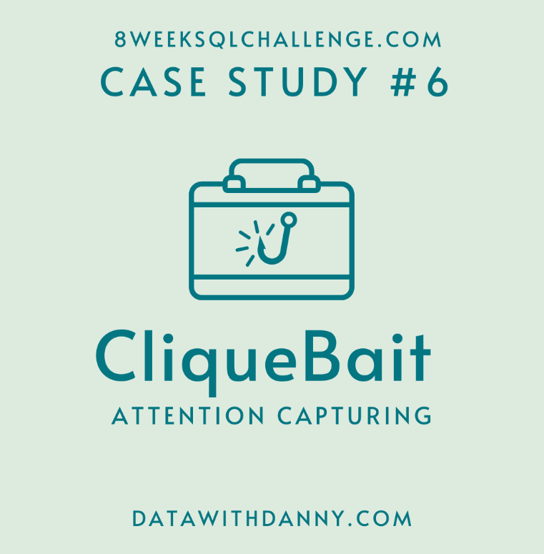
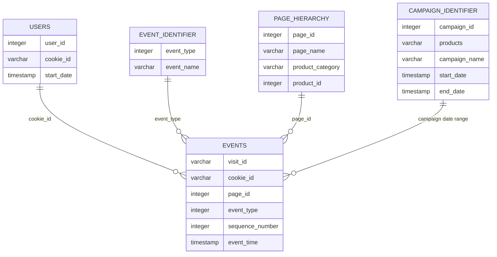

# Clique Bait: Digital Funnel and Campaign Analysis

  

## Project Overview

Clique Bait is an online seafood store that collects detailed website-interaction data.

This project uses PostgreSQL to analyse user visits, page views, shopping-cart behaviour, product conversion, checkout abandonment and digital-marketing campaigns.

This project is based on Case Study 6 of the [8 Week SQL Challenge](https://8weeksqlchallenge.com/case-study-6/) created by Data With Danny.

---

## Table of Contents

- [Business Task](#business-task)
- [Dataset](#dataset)
- [Event Types](#event-types)
- [Entity Relationship Diagram](#entity-relationship-diagram)
- [Analysis Sections](#analysis-sections)
- [Tools and SQL Techniques](#tools-and-sql-techniques)
- [Key Findings](#key-findings)
- [Assumptions and Limitations](#assumptions-and-limitations)
- [Source](#source)

---

## Business Task

Clique Bait wants to understand how customers interact with its website and marketing campaigns.

The analysis focuses on:

- Website traffic
- User and cookie behaviour
- Page engagement
- Product views
- Shopping-cart activity
- Checkout abandonment
- Product-funnel conversion
- Advertising impressions and clicks
- Campaign performance

---

## Dataset

The database contains five tables:

| Table | Description |
|---|---|
| `users` | Maps users to website cookies |
| `events` | Contains all website-interaction events |
| `event_identifier` | Provides the name of each event type |
| `page_hierarchy` | Contains page, product and category information |
| `campaign_identifier` | Contains campaign names, dates and promoted products |

---

## Event Types

| Event type | Event name |
|---:|---|
| 1 | Page View |
| 2 | Add to Cart |
| 3 | Purchase |
| 4 | Ad Impression |
| 5 | Ad Click |

---

## Entity Relationship Diagram

### Relationships

- `events.cookie_id` joins to `users.cookie_id`
- `events.event_type` joins to `event_identifier.event_type`
- `events.page_id` joins to `page_hierarchy.page_id`
- A visit is assigned to a campaign when its start time falls between the campaign start and end dates

The campaign relationship is time-based rather than a direct foreign-key relationship.

---

## Analysis Sections

1. [Digital Analysis](./01-digital-analysis.md)
2. [Product Funnel Analysis](./02-product-funnel.md)
3. [Campaign Analysis](./03-campaign-analysis.md)

---

## Tools and SQL Techniques

### Tools

- PostgreSQL 13
- DB Fiddle
- GitHub
- Markdown

### SQL techniques

- Table joins
- Aggregate functions
- Common Table Expressions
- Conditional aggregation
- Window functions
- Date analysis
- Funnel analysis
- Conversion-rate calculations
- Behavioural segmentation
- Campaign attribution
- String aggregation

---

## Key Findings

- Clique Bait has 500 identifiable users.
- Each user has approximately 3.56 cookies on average.
- Approximately 49.86% of visits resulted in a purchase.
- Approximately 15.50% of visitors who reached checkout did not purchase.
- The All Products page received the most page views.
- Oyster was the most viewed individual product.
- Lobster had the most cart additions and purchases.
- Russian Caviar had the highest number of abandoned cart additions.
- Lobster had the highest view-to-purchase rate at 48.74%.
- The average view-to-cart conversion rate was 60.95%.
- The average cart-to-purchase conversion rate was 75.93%.

---

## Assumptions and Limitations

- A purchase event applies to all products added to the cart during that visit.
- A product is considered abandoned when it is added to the cart during a visit without a purchase event.
- A customer may have several cookies.
- Campaign attribution is based on the visit start time.
- A campaign association does not prove that the campaign caused the purchase.
- The dataset does not contain product prices or revenue.
- Cookie deletion or use across multiple devices may affect user identification.

---

## Source

The original case study, dataset and cover artwork were created by [Data With Danny](https://8weeksqlchallenge.com/case-study-6/).

All SQL queries, explanations and business interpretations in this repository form part of my own analysis.
