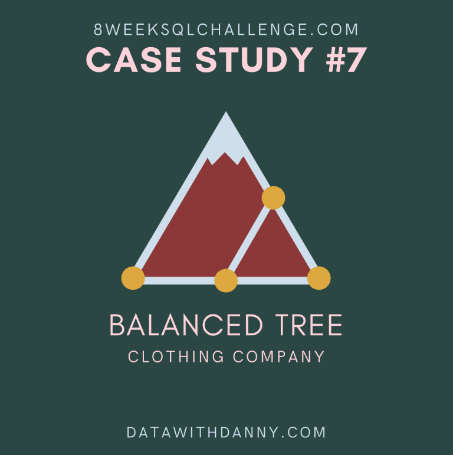
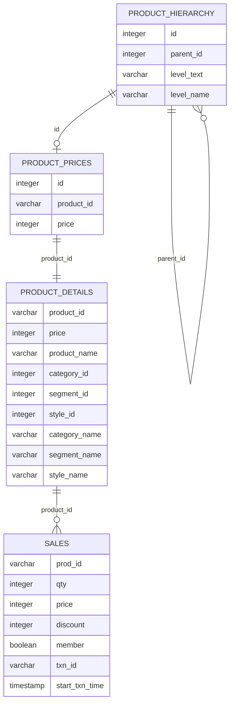

# Balanced Tree Clothing Co.: Sales and Merchandising Analysis

  

## Project Overview

Balanced Tree Clothing Co. provides clothing and lifestyle products for modern adventurers.

This project uses PostgreSQL to analyse sales performance, customer transactions, product performance, discount activity and product-hierarchy data.

The project also develops a reusable monthly financial-reporting process for the merchandising and finance teams.

This project is based on Case Study 7 of the [8 Week SQL Challenge](https://8weeksqlchallenge.com/case-study-7/) created by Data With Danny.

---

## Table of Contents

- [Business Task](#business-task)
- [Dataset](#dataset)
- [Entity Relationship Diagram](#entity-relationship-diagram)
- [Analysis Sections](#analysis-sections)
- [Tools and SQL Techniques](#tools-and-sql-techniques)
- [Key Findings](#key-findings)
- [Assumptions and Limitations](#assumptions-and-limitations)
- [Source](#source)

---

## Business Task

Balanced Tree wants to analyse its sales and generate a basic financial report for the wider business.

The analysis focuses on:

- Product quantity sold
- Gross revenue
- Discount value
- Transaction behaviour
- Member and non-member performance
- Product, segment and category performance
- Product penetration
- Frequently purchased product combinations
- Reusable monthly reporting
- Product-hierarchy transformation

---

## Dataset

The database contains four tables:

| Table | Description |
|---|---|
| `product_details` | Denormalised product, category, segment and style information |
| `sales` | Product-level transaction records |
| `product_hierarchy` | Category, segment and style hierarchy |
| `product_prices` | Product identifiers and prices for style-level products |

The first two tables support the regular analysis. The hierarchy and price tables are used for the bonus challenge.

---

## Entity Relationship Diagram

### Relationships

- `sales.prod_id` joins to `product_details.product_id`
- `product_prices.id` joins to the style-level `product_hierarchy.id`
- `product_hierarchy.parent_id` joins recursively to `product_hierarchy.id`
- `product_prices.product_id` maps to `product_details.product_id`

The `product_details` table is a denormalised version of the hierarchy and pricing data.

---

## Analysis Sections

1. [High-Level Sales Analysis](./01-high-level-sales.md)
2. [Transaction Analysis](./02-transaction-analysis.md)
3. [Product Analysis](./03-product-analysis.md)
4. [Monthly Reporting Challenge](./04-monthly-reporting.md)
5. [Bonus Product-Details Transformation](./05-bonus-product-details.md)

---

## Tools and SQL Techniques

### Tools

- PostgreSQL 13
- DB Fiddle
- GitHub
- Markdown

### SQL techniques

- Aggregate functions
- Table joins
- Common Table Expressions
- Window functions
- Ranking functions
- Percentile calculations
- Conditional aggregation
- Percentage calculations
- Self joins
- Recursive CTEs
- Monthly date parameters
- Product-hierarchy analysis

---

## Key Findings

- Balanced Tree sold 45,216 units.
- Gross revenue before discounts was $1,289,453.
- Customers received $156,229.14 in discounts.
- The dataset contains 2,500 unique transactions.
- Customers purchased approximately 6.04 unique products per transaction.
- Members generated 60.2% of transactions.
- Member and non-member gross transaction values were very similar.
- Blue Polo Shirt was the highest-revenue product.
- Mens products generated 55.38% of gross revenue.
- Shirts generated the largest segment revenue.
- Navy Solid Socks had the highest transaction penetration at 51.24%.

---

## Assumptions and Limitations

- Revenue refers to gross revenue before discounts unless stated otherwise.
- Discount values are calculated as `quantity × price × discount percentage`.
- All product rows within a transaction are assumed to share the same membership status and transaction time.
- Product penetration measures whether a product appeared in a transaction, regardless of quantity.
- The dataset does not include product cost, so gross profit cannot be calculated.
- The dataset does not contain customer identifiers, limiting customer-retention analysis.
- Product combinations are based on products occurring in the same transaction and do not imply purchase order or dependency.

---

## Source

The original case study, dataset and cover artwork were created by [Data With Danny](https://8weeksqlchallenge.com/case-study-7/).

All SQL queries, explanations and business interpretations in this repository form part of my own analysis.
