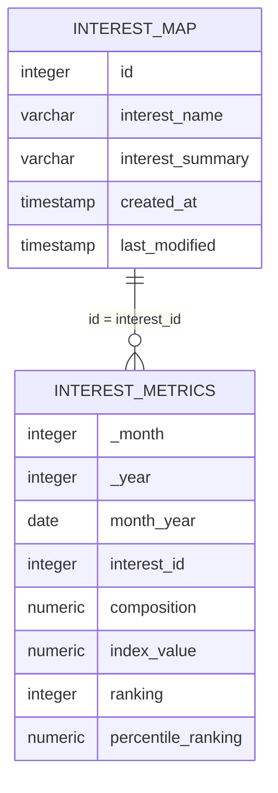

# Fresh Segments: Digital Marketing Interest Analysis

<p align="center">
  
</p>

## Project Overview

Fresh Segments is a digital marketing agency that helps businesses analyse trends in online advertising behaviour.

Clients provide customer lists, and Fresh Segments creates monthly aggregated metrics showing how strongly those customers interact with different interests.

This project uses PostgreSQL to clean and analyse customer-interest data, measure interest consistency, identify changing customer preferences and evaluate the reliability of the agency's interest-index model.

This project is based on Case Study 8 of the [8 Week SQL Challenge](https://8weeksqlchallenge.com/case-study-8/) created by Data With Danny.

---

## Table of Contents

- [Business Task](#business-task)
- [Dataset](#dataset)
- [Metric Definitions](#metric-definitions)
- [Entity Relationship Diagram](#entity-relationship-diagram)
- [Analysis Sections](#analysis-sections)
- [Tools and SQL Techniques](#tools-and-sql-techniques)
- [Key Findings](#key-findings)
- [Assumptions and Limitations](#assumptions-and-limitations)
- [Source](#source)

---

## Business Task

Fresh Segments wants to better understand the interests represented within a client's customer base.

The analysis focuses on:

- Data quality and missing records
- Interest coverage across months
- Stable and short-lived interests
- Customer-interest composition
- Interest rankings
- Changes in percentile rankings
- Monthly top-performing interests
- Average client composition
- Seasonal changes in customer behaviour
- Potential weaknesses in the interest-index model

---

## Dataset

The database contains two tables:

| Table | Description |
|---|---|
| `interest_metrics` | Monthly performance metrics for each customer interest |
| `interest_map` | Interest names, descriptions and creation dates |

---

## Metric Definitions

### Composition

The percentage of the client's customer list that interacted with online content related to an interest.

For example, a composition of `11.89` means that approximately 11.89% of the client's customers interacted with that interest.

### Index value

The client's composition divided by the average composition for all Fresh Segments clients.

An index value greater than `1` indicates that the client's customers are more interested in that topic than the average Fresh Segments customer base.

### Ranking

The position of an interest when interests are ordered by index value within a month.

A lower ranking value represents stronger relative performance.

### Percentile ranking

The relative position of an interest compared with all other interests in the same month.

A higher percentile ranking represents stronger relative performance.

### Average composition

Average composition for all Fresh Segments clients can be estimated using:

```text
Client composition ÷ index value
```

---

## Entity Relationship Diagram



### Relationship

`interest_metrics.interest_id` joins to `interest_map.id`.

Each interest can have several monthly metric records, while each metric record relates to one mapped interest.

---

## Analysis Sections

1. [Data Exploration and Cleansing](./01-data-exploration-cleansing.md)
2. [Interest Analysis](./02-interest-analysis.md)
3. [Segment Analysis](./03-segment-analysis.md)
4. [Index Analysis](./04-index-analysis.md)

---

## Tools and SQL Techniques

### Tools

- PostgreSQL 13
- DB Fiddle
- GitHub
- Markdown

### SQL techniques

- Data-type conversion
- Data-quality validation
- Anti joins
- Common Table Expressions
- Window functions
- Ranking functions
- Cumulative percentages
- Standard deviation
- Conditional aggregation
- Three-month rolling averages
- `LAG()`
- Customer-segment analysis

---

## Key Findings

- The dataset contains 1,194 records without a valid month or interest identifier.
- There are 1,209 interests in the mapping table and 1,202 interests in the metrics table.
- Seven mapped interests have no corresponding metric records.
- The analysis covers 14 monthly periods from July 2018 through August 2019.
- A total of 480 interests appeared in every month.
- Interests present for six or more months represent approximately 90.85% of all unique interests.
- Removing interests appearing in fewer than six months removes 110 interests and 400 metric records.
- The filtered dataset contains 1,092 unique interests.
- Work Comes First Travelers recorded the highest maximum composition value.
- Winter Apparel Shoppers had the strongest average ranking.
- Alabama Trip Planners, Luxury Bedding Shoppers and Solar Energy Researchers appeared most frequently among the monthly top-ten average-composition interests.
- Average composition among the top interests fell significantly from May 2019 onward.

---

## Assumptions and Limitations

- Records without a valid month or interest identifier are excluded from the analysis but retained in the original source table.
- An interest must appear in at least six different months to be included in the filtered segment analysis.
- The first day of each month represents the entire monthly reporting period.
- Interests created later within the same month as their first metric record are considered valid.
- Composition and ranking indicate association with online behaviour, not confirmed customer purchases.
- Customer identities, advertising costs, conversions and revenue are not included.
- Interest rankings may be influenced by changes in the Fresh Segments comparison population.
- Seasonal interests may appear inconsistent even when the data is valid.

---

## Source

The original case study, dataset and cover artwork were created by [Data With Danny](https://8weeksqlchallenge.com/case-study-8/).

All SQL queries, explanations and business interpretations in this repository form part of my own analysis.
